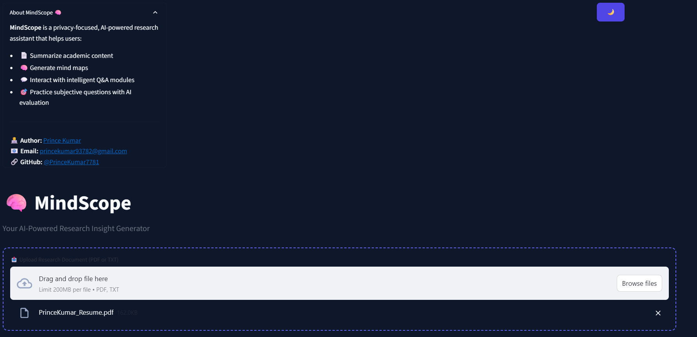

# 🧠 MindScope: Smart Assistant for Research Summarization

A full-stack AI-powered web assistant that helps users upload academic PDFs or TXT files, understand them quickly via executive summaries, mind maps, Q&A, and evaluate their knowledge through a subjective challenge mode — all powered by the Groq API.

---

## 🌐 Live Demo

🔗 [Try it on Streamlit →]()

---


## 🚀 Features

- 📤 **Upload Research Document** (`PDF` or `TXT`)
- 🧠 **Mind Map Generator**  
  → Visual concept map from document using TF-IDF
- 📄 **Executive Summary**  
  → Llama3 70B-powered summarization (via Groq)
- 💬 **Q&A Mode**  
  → Ask any question and get contextual answer + justification
- 🎯 **Challenge Mode**
  → Generate 2 descriptive questions based only on the document  
  → User types their answers → AI evaluates them with feedback
- ✅ **Fully Local UI**  
  → Modular Streamlit layout (via `ui_config.py`)
- 🔐 **API key secured via `.env`**

---

## 🛠️ Tech Stack

| Layer       | Tools Used                                  |
|-------------|----------------------------------------------|
| Backend     | Python, Django (for API if extended)         |
| Frontend    | Streamlit, HTML, CSS, Bootstrap              |
| LLM         | `llama3-70b-8192` via **Groq API**           |
| Mind Map    | `scikit-learn`, `Graphviz` (TF-IDF based)    |
| Summary     | Groq Client + Prompt Engineering             |
| Q&A         | Groq Client + Contextual Justification       |
| Challenge   | Only **Subjective Questions** + AI Feedback  |
| File Parsing| PyPDF2, StringIO, secure handling            |
| Environment | `.env` file for storing API keys             |

---


## 🖼️ UI Preview

 


---


## 🎥 Demo Video

Watch a quick walkthrough of **MindScope** in action:

[](https://youtu.be/JxIVDbjs9Qw)


---

## ⚙️ Setup Instructions

To run this project locally:

```bash
# Clone the repository
git clone https://github.com/jhagauravkr/MindScope.git
cd MindScope

# Set up virtual environment (recommended)
python -m venv venv
# On Windows:
venv\Scripts\activate


# Install dependencies
pip install -r requirements.txt

# Launch the Streamlit app
streamlit run app.py


